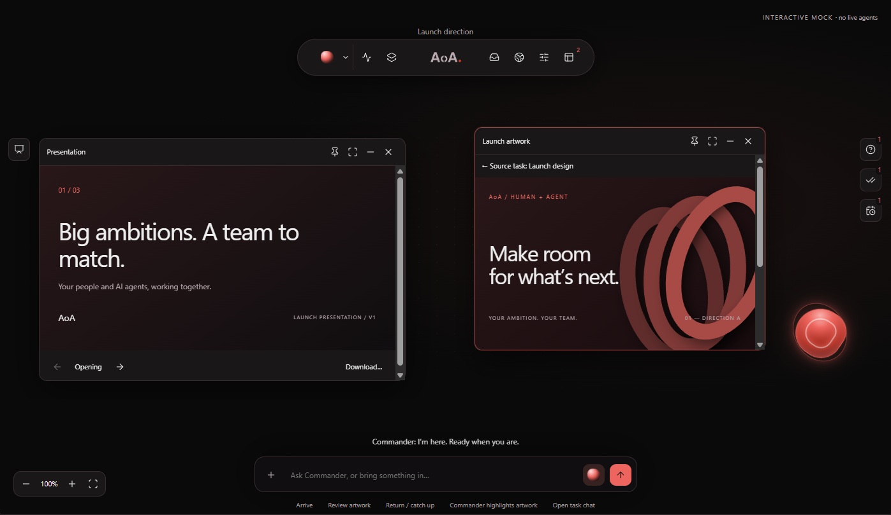
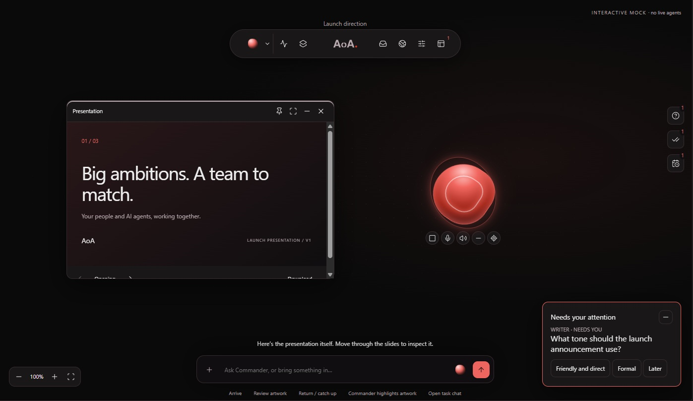

<div align="center">

# Army of Agents

### The organizational harness for human and AI teams

Run people and AI agents from one governed control plane for goals, work, context, and outcomes.

[Website](https://armyofagents.org) · [Documentation](docs/) · [Issues](https://github.com/tandavkrishna27/Army-of-Agents/issues)


[](https://github.com/tandavkrishna27/Army-of-Agents/actions/workflows/pr.yml)
[](https://nodejs.org/)
[](https://pnpm.io/)

</div>

Army of Agents gives organizations one control plane for people, AI agents, goals, tasks, discussions, memory, approvals, budgets, and outputs. It provides the operating structure that lets AI agents work as members of a team instead of as disconnected chats, prompts, and scripts.

## Contents

- [What is Army of Agents?](#what-is-army-of-agents)
- [Universe UI](#universe-ui)
- [How it works](#how-it-works)
- [Core capabilities](#core-capabilities)
- [Supported runtimes](#supported-runtimes)
- [Marketplace and ecosystem](#marketplace-and-ecosystem)
- [Try AoA locally](#try-aoa-locally)
- [Deploy with Docker](#deploy-with-docker)
- [Repository structure](#repository-structure)
- [Development](#development)
- [Contributing](#contributing)
- [Security](#security)
- [Support](#support)
- [Code of conduct](#code-of-conduct)
- [License](#license)
- [Project status](#project-status)

## What is Army of Agents?

Army of Agents is a hybrid workforce operating system for organizations that use AI agents alongside human teammates.

It helps you:

- define company and team goals;
- organize human and AI team members;
- assign work with context and ownership;
- connect different agent runtimes;
- control permissions and approvals;
- enforce budgets and spending limits;
- preserve discussions, memory, and execution context; and
- review activity, artifacts, and outcomes.

Agents perform work. Army of Agents provides the organization in which that work happens.

## Universe UI

> **Under development** —Universe (Some people call it Jarvis, Cortana, Zoe, or whatever name they give their AI. I just think of it as your whole universe in one place.)
Universe is where everything comes together — you, the people you work with, your agents, conversations, tasks, files, tools, and whatever you’re currently working on.
Instead of jumping between ten different apps and talking to different AI agents separately, you have one space where you can just say what you want to do. Your Commander understands the context, pulls in the right people or agents, opens whatever needs to be worked on, and helps move things forward.
The idea is not really another dashboard. It is more like a place you work from — where humans and agents can be around you, things can keep happening in the background, and you can zoom into whatever needs your attention.
It is still under development, and what you see below is an early visual concept. The interface will probably keep changing as I figure out what this should actually feel like.The screenshots below are an early visual concept and may change as implementation progresses.





## How it works

1. **Define the organization.** Create a company workspace with goals, teams, roles, and operating context.
2. **Build the team.** Add human members and connect AI agents through supported runtimes.
3. **Assign work.** Create tasks that carry ownership, context, priorities, and goal alignment.
4. **Run and supervise.** Let agents execute work while the organization controls permissions, approvals, schedules, and budgets.
5. **Review the results.** Inspect activity, discussions, artifacts, costs, and decisions from one control plane.

## Product pillars

| Pillar | Includes |
| --- | --- |
| **Organization** | Companies, teams, roles, agents, goals, and Crew |
| **Execution** | Tasks, adapters, routines, heartbeats, and workspaces |
| **Context** | Commander, discussions, threads, memory, and skills |
| **Governance** | Approvals, budgets, permissions, and audit history |
| **Outputs** | Artifacts, versions, previews, branches, and pull requests |

## Core capabilities

### Commander

Commander is the built-in internal coordination assistant for your company. It can work with company context, answer questions about work and decisions, inspect tasks, discussions, memory, and artifacts, and coordinate activity across the organization.

Commander proposes and performs actions within the company’s approval and runtime-governance rules. It is a conductor for the organization, not a replacement for human decision makers.

### Crew

The Crew is the coordinated group of company-wide AI roles that helps turn discussions and goals into work.

Crew agents can participate in threads, help scope discussions into tasks, execute assigned work, report results to the originating thread, and use explicitly assigned skills. Crew execution remains subject to permissions, approvals, budgets, task ownership, and autonomy controls.

### Company Brain

The Company Brain is the organization’s shared context layer. It brings together:

- approved memory;
- company goals and objectives;
- discussions and decisions;
- task history;
- artifacts and files;
- team and role context; and
- activity and execution history.

Memory is company-scoped and visibility-aware. People and agents see only the context allowed by their role, scope, and permissions.

### Discussions and threads

Discussions are where ideas, questions, decisions, and unstructured input begin.

Threads provide a durable workspace for focused collaboration and orchestration. A thread can collect related entries and decisions, maintain scoped context, involve humans, Commander, and Crew agents, produce task proposals, track phases and ownership, and pause, transfer, fork, merge, or promote work.

Discussions can feed structured tasks while preserving the original conversation and decision history.

### Goals and tasks

Goals connect day-to-day work to company priorities. Tasks provide clear ownership, execution context, lifecycle controls, human or agent assignment, budget-aware execution, comments, activity history, and links to discussions, artifacts, and workspaces.

### Routines and heartbeats

Routines define recurring or event-driven work. Heartbeats give agents bounded execution windows to wake up, inspect assigned context, perform work, and report progress without requiring a separate chat window to remain open.

### Governance and approvals

Army of Agents keeps important decisions reviewable through:

- company and role permissions;
- approval gates;
- agent autonomy settings;
- budget hard stops;
- runtime approvals;
- activity logging;
- pause and kill controls; and
- company-scoped access boundaries.

### Artifacts and workspaces

Artifacts are durable outputs connected to the work that produced them. Engineering tasks can use isolated workspaces for source changes, terminals, previews, Git operations, reviews, and pull requests.

## Supported runtimes

Army of Agents connects to agent runtimes through adapters. The repository currently includes integrations for:

- Claude Code;
- Codex;
- Cursor;
- Gemini;
- OpenCode;
- OpenClaw;
- Hermes;
- generic local processes; and
- HTTP-based runtimes.

Availability depends on local configuration, credentials, and the runtime being installed on the host machine. If your runtime is not listed, the adapter SDK and generic process/HTTP integrations provide extension points for connecting it.

## Marketplace and ecosystem

Army of Agents connects to an ecosystem of catalogs, skills, plugins, agents, teams, and community resources.

- [aoa-marketplace](https://github.com/tandavkrishna27/aoa-marketplace) — source-of-truth monorepo for marketplace infrastructure and AoA-curated plugins, skills, agents, and teams.
- [aoa-marketplace-cdn](https://github.com/tandavkrishna27/aoa-marketplace-cdn) — public catalog distribution repository. Army of Agents uses its published catalog and connector manifests as the default external source.
- [AoA-Skills](https://github.com/tandavkrishna27/AoA-Skills) — canonical Commander instruction files, skills, model overlays, and platform configuration.
- [aoa-community](https://github.com/tandavkrishna27/aoa-community) — community-contributed tools, plugins, templates, teams, and learning resources.

The application maintains a cache and bundled fallback for catalog availability, so the marketplace is an integration point rather than a requirement for every local operation.

## Try AoA locally

The local quickstart is for exploring AoA on your own machine. It does not require Google login, Google OAuth credentials, or a separately managed PostgreSQL database. The first run opens AoA's existing onboarding flow.

### Requirements

- Node.js 20.3 or newer
- pnpm 9 or newer (available through Corepack)
- Git

### Install

```bash
git clone https://github.com/tandavkrishna27/Army-of-Agents.git
cd Army-of-Agents

corepack enable
pnpm install --frozen-lockfile
pnpm build
pnpm aoa onboard --yes
```

The build step prepares the workspace packages required to run AoA from a source checkout. With the default environment, the CLI then configures a loopback-only local instance and uses embedded PostgreSQL. Open `http://localhost:3100`; a first-time user is taken to `/onboarding` to create their profile, company, and first team setup.

You can explore and complete onboarding without configuring an AI provider. To get a real Commander or agent response, install and sign in to a supported provider CLI (such as Codex or Claude) on the same machine, or configure the provider credentials AoA supports.

> **Local access only:** this default mode trusts the local operator and binds to loopback. Do not expose it to your LAN or the public internet. Review the deployment guide before setting up shared access.

The bootstrap command honors relevant environment overrides. For a clean default setup, make sure variables such as `AOA_DEPLOYMENT_MODE`, `HOST`, and `DATABASE_URL` are not set in your shell. See the [full quickstart](docs/start/quickstart.md) for onboarding details and troubleshooting.

### Deploy with Docker

Docker is a separate authenticated deployment path, not the login-free local trial: the current Docker quickstart defaults to authenticated mode and requires the operator to configure Google OAuth. See the [Docker deployment guide](docs/deploy/docker.md).

## Repository structure

```text
server/          Express API, services, adapters, and background execution
ui/              React application
packages/db/     Drizzle schema, migrations, and database clients
packages/shared/ Shared types, validators, constants, and API contracts
packages/adapters Adapter utilities and runtime integrations
docs/            Architecture, API, deployment, and project documentation
```

## Development

For contributing to AoA, use the development server and verification commands below. This path is intended for development, not as the quickest way to try the app.

```bash
pnpm dev
```

The development server runs at `http://localhost:3100`. When `DATABASE_URL` is unset, it uses the bundled embedded PostgreSQL instance. Agent integrations still need their own provider CLI or credentials for live execution.

Run the standard verification commands before submitting changes:

```bash
pnpm -r typecheck
pnpm test:run
pnpm build
```

For database schema changes:

```bash
pnpm db:generate
```

Before opening a pull request:

1. Read [`AGENTS.md`](AGENTS.md) for repository rules and development workflow.
2. Read [`CLAUDE.md`](CLAUDE.md) for the architecture baseline and naming map.
3. Check [`docs/architecture/decisions.md`](docs/architecture/decisions.md) before changing a product or platform contract.
4. Keep the database, shared types, server, UI, adapters, and documentation synchronized.
5. Run the verification commands below.

Additional project planning information is in [`docs/roadmap.md`](docs/roadmap.md).

## Contributing

See [CONTRIBUTING.md](CONTRIBUTING.md) for the full contributor workflow, setup instructions, verification expectations, database workflow, docs guidance, and pull request checklist.

Contributions should:

- preserve company-scoped data access;
- keep database, API, shared types, server, UI, and documentation contracts synchronized;
- preserve approval, budget, and audit invariants;
- use Drizzle for database schema changes;
- update affected documentation when behavior changes; and
- avoid changing locked architectural decisions without an explicit replacement decision.

Open an issue or pull request with the problem being solved, intended behavior, affected areas, verification steps, and any migration or compatibility considerations.

## Security

Please do not report security vulnerabilities through public GitHub issues. Follow [SECURITY.md](SECURITY.md) for private reporting guidance, supported versions, and safe testing expectations.

## Support

Use [SUPPORT.md](SUPPORT.md) to choose the right channel for setup help, bug reports, feature requests, and security reports.

## Code of conduct

Participation in this project is covered by [CODE_OF_CONDUCT.md](CODE_OF_CONDUCT.md).

## License

Army of Agents is licensed under the [MIT License](LICENSE).

## Project status

Army of Agents is actively developed software. The current product line is version 1. Capabilities, integrations, and marketplace content continue to evolve.

## Learn more

- [armyofagents.org](https://armyofagents.org)
- [Architecture decisions](docs/architecture/decisions.md)
- [Project documentation](docs/)
- [Installation report](docs/aoa/reports/first-install-report.md)

