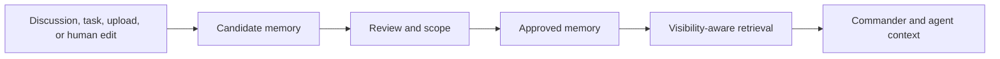

Company Brain is the durable knowledge layer for Army of Agents. It gives Commander and agents useful context without turning every note, transcript, or one-off correction into permanent truth.

## When to use this page

Use Company Brain when you want to:

- preserve company identity, operating rules, or domain knowledge
- approve or reject memory suggestions from agents
- decide what context an agent should see during a task
- clean up stale or incorrectly scoped knowledge
- understand why Commander or an agent did or did not use a fact

## How Company Brain works

Memory is not just search. It has layers, scopes, ownership, lifecycle state, and approval rules.

## Memory layers

| Layer | Use it for | Typical approval |
| --- | --- | --- |
| Identity | Mission, values, positioning, enduring company facts | Founder |
| Domain | Department playbooks, customer knowledge, reusable operating rules | Founder |
| Active Context | Goal, project, or initiative context that should guide current work | Founder or eligible team lead |
| Working | Short-lived task-chain context | Runtime-created and lifecycle-managed |

Agents can suggest memory, but high-trust durable memory requires human approval. This keeps the Company Brain useful instead of letting every agent output become permanent context.

## Before you approve memory

Check three things:

1. **Truth**: is the statement accurate today?
2. **Scope**: should it apply company-wide, to a department, to a project, or only to a task chain?
3. **Durability**: should the system remember this for future work, or is it temporary context?

<Warning>
  A broad, approved memory item can influence many future runs. Prefer narrower scope when the fact only applies to one department, project, customer, or task chain.
</Warning>

## Review pending memory

<Steps>
  <Step title="Open Memory">
    Go to Memory Explorer and open **Pending Review**.
  </Step>
  <Step title="Inspect the source">
    Read the suggested item and open the source task, discussion, upload, or agent run when available.
  </Step>
  <Step title="Edit the wording">
    Rewrite the memory as a durable fact or operating rule. Remove one-off phrasing and temporary details.
  </Step>
  <Step title="Choose layer and scope">
    Select the narrowest layer and scope that will help future work.
  </Step>
  <Step title="Approve or reject">
    Approve useful memory, reject noise, and archive stale entries.
  </Step>
</Steps>

## How to verify it worked

After approval:

- the item leaves Pending Review
- it appears in the correct folder, layer, or scoped view
- semantic search can find it after embeddings are available
- a future Commander or agent turn can use it when the actor has visibility

The OpenAI key in **Settings → Memory** is for embeddings only. Discussion extraction and Crew memory extraction run through local CLI paths, not hosted extraction keys.

## Troubleshooting

<AccordionGroup>
  <Accordion title="Search does not find a new memory item">
    Check whether embeddings are configured and whether indexing has completed. Memory Explorer shows warnings when embeddings are unavailable.
  </Accordion>
  <Accordion title="An agent did not see a memory item">
    Check the actor, visibility, department, project, goal, and task scope. Retrieval is intentionally actor-aware and scope-aware.
  </Accordion>
  <Accordion title="Pending memory is noisy">
    Reject one-off suggestions. Durable suggestions should usually reflect repeated patterns or important company facts.
  </Accordion>
</AccordionGroup>

## Related docs

<CardGroup cols={2}>
  <Card title="Memory Explorer" href="/guides/board-operator/memory">
    Use the Memory UI to search, review, upload, and inspect graph context.
  </Card>
  <Card title="Discussions" href="/guides/board-operator/discussions">
    Turn unstructured threads into tasks and memory candidates.
  </Card>
</CardGroup>
