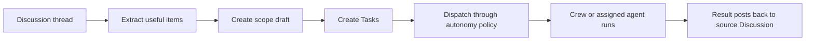

Crew is the Army of Agents-managed agent layer that helps convert company discussion into executable work. It is useful when a thread contains enough context for AI help, but the work still needs structure, review, and governance.

## When to use Crew

Use Crew when you want to:

- turn a long discussion into scoped tasks
- let an AI agent draft work while preserving human review
- route work from a thread to the right department or agent
- keep results connected to the original discussion
- move from planning to execution with approval controls

## The Crew loop

## Autonomy modes

| Mode | What happens | Best for |
| --- | --- | --- |
| Manual | Crew proposes cards and waits for a human to accept them | New workflows and sensitive work |
| Assist | Crew creates planning tasks and asks for dispatch approval | Teams that want speed with a human release gate |
| Drive | Crew creates standard tasks and dispatches when preflight checks pass | Trusted workflows with clear boundaries |

Preflight checks can still block dispatch. Budget hard stops, thread pause state, and governance settings continue to apply.

## Run Crew from a Discussion

<Steps>
  <Step title="Open the source thread">
    Go to Discussions and open the thread that contains the idea, transcript, customer note, or planning context.
  </Step>
  <Step title="Create or refresh the scope draft">
    Ask Crew to scope the thread. Army of Agents extracts unprocessed entries and turns useful items into candidate work.
  </Step>
  <Step title="Review the cards">
    Edit task titles, descriptions, acceptance criteria, assignees, and scope before accepting work.
  </Step>
  <Step title="Choose dispatch behavior">
    In Manual, accept cards yourself. In Assist, approve the dispatch request from Inbox. In Drive, confirm that budget and thread settings allow automatic dispatch.
  </Step>
  <Step title="Monitor result loopback">
    Watch the created task, run summary, and source Discussion. Successful work and failures both remain connected to the originating thread.
  </Step>
</Steps>

## What Crew can and cannot do

Crew can:

- use allowed skills and tools attached to its identity
- create tasks from extracted discussion context
- post results and failure cards back to the source thread
- ask humans questions when a run needs input
- suggest memory according to memory rules

Crew cannot:

- bypass approval gates
- ignore budget hard stops
- approve high-trust memory on its own
- see private or out-of-scope memory it is not allowed to retrieve
- mark a task accepted when the completion policy requires review

## How to verify it worked

Check these places:

- the source Discussion has scope cards, result loopback, or failure cards
- the created Tasks contain the expected source link and acceptance criteria
- Inbox contains any dispatch approval or work question that requires action
- Activity shows the important mutations
- Budget reflects any recorded run cost

## Troubleshooting

<AccordionGroup>
  <Accordion title="No useful task cards were created">
    Check whether the thread has enough concrete content. Add a clearer goal, constraints, or acceptance criteria, then create a new scope draft.
  </Accordion>
  <Accordion title="Assist mode created tasks but did not run them">
    Open Inbox and approve the Crew dispatch request. Assist mode intentionally parks tasks in planning until approved.
  </Accordion>
  <Accordion title="Drive mode did not dispatch">
    Check budget hard stops, thread pause state, disabled crew settings, and adapter readiness.
  </Accordion>
  <Accordion title="The result did not appear in the source thread">
    Open the task and run summary. Loopback is best-effort, so the task remains the source of execution truth if the thread card could not be posted.
  </Accordion>
</AccordionGroup>

## Related docs

<CardGroup cols={2}>
  <Card title="Discussions" href="/guides/board-operator/discussions">
    Learn the thread workspace that feeds Crew.
  </Card>
  <Card title="Tasks and reviews" href="/guides/board-operator/managing-tasks">
    Review and complete the work Crew creates.
  </Card>
</CardGroup>
