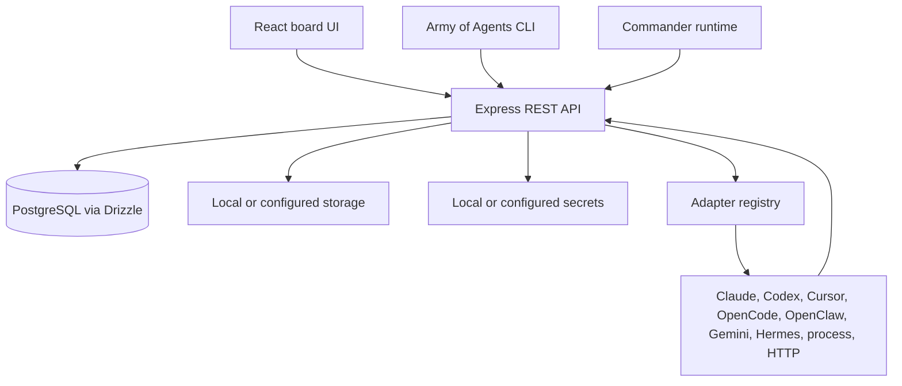
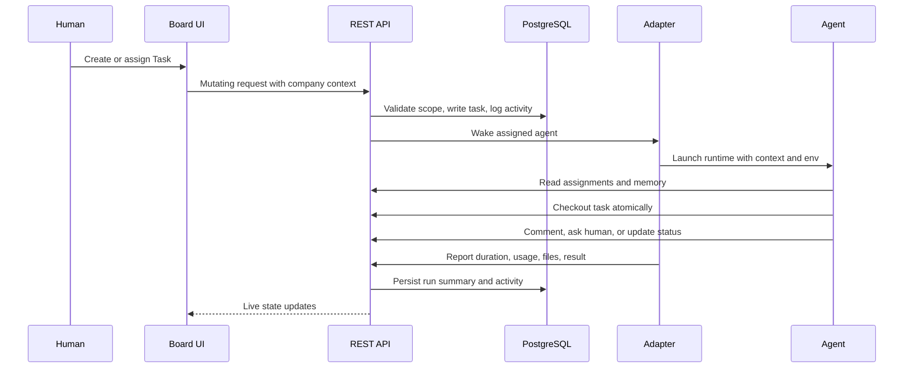

Army of Agents is a control plane for human and AI work. The web app owns company state, governance, memory, tasks, and audit history. Agent runtimes run through adapters and report back through the API.

## System shape



## Layers

| Layer | What it owns |
| --- | --- |
| React UI | Home, Inbox, Commander, Discussions, Tasks, Team, Memory, Budget, Activity, Settings |
| Express API | Auth, company scoping, routes, services, adapters, heartbeat, approvals |
| PostgreSQL | Company data, tasks, comments, memory, runs, settings, audit records |
| Adapters | Runtime-specific launch, diagnostics, output parsing, and configuration fields |
| CLI | Onboarding, local run, setup checks, and control-plane commands |

## Repository map

```txt
server/src/           Express API, routes, services, adapters, heartbeat
ui/src/               React and Vite board UI
packages/db/          Drizzle schema, migrations, database clients
packages/shared/      Shared types, constants, validators, API path constants
packages/adapters/    Adapter packages and utilities
cli/                  Army of Agents command line entry points
docs/                 Public Mintlify docs and internal project docs
```

## Request and heartbeat flow



## Adapter model

Adapters keep the control plane independent from any one agent runtime. A built-in adapter can launch a local CLI, call a process, or send work to an HTTP service.

Built-in adapter families include Claude Local, Codex Local, Cursor, OpenCode, OpenClaw, Gemini Local, Hermes Local, Process, and HTTP.

Each adapter normally contributes:

- server execution logic
- configuration fields for the UI
- diagnostics for setup and health checks
- output parsing for run views
- CLI formatting for terminal workflows

## Data and naming boundaries

Army of Agents keeps shipped wire contracts stable. The public UI says Home, Task, Budget, Team, and Discussion. Some API routes and database tables keep older names such as `/dashboard`, `/issues`, or `issues` for compatibility.

Do not infer that an API route name is the preferred product word. Public operator docs should use the UI language.

## Governance boundaries

Key invariants:

- every domain entity is company-scoped
- task execution follows the single-assignee checkout model
- governed actions can require approval
- budget hard stops can pause agents
- mutating actions are logged
- memory visibility is actor-aware and scope-aware
- agents can suggest durable memory, but approval rules decide what becomes trusted context

## Where to go next

<CardGroup cols={2}>
  <Card title="Core concepts" href="/start/core-concepts">
    Learn the product vocabulary used by the architecture.
  </Card>
  <Card title="Adapter overview" href="/adapters/overview">
    Choose how your agents will run.
  </Card>
</CardGroup>
