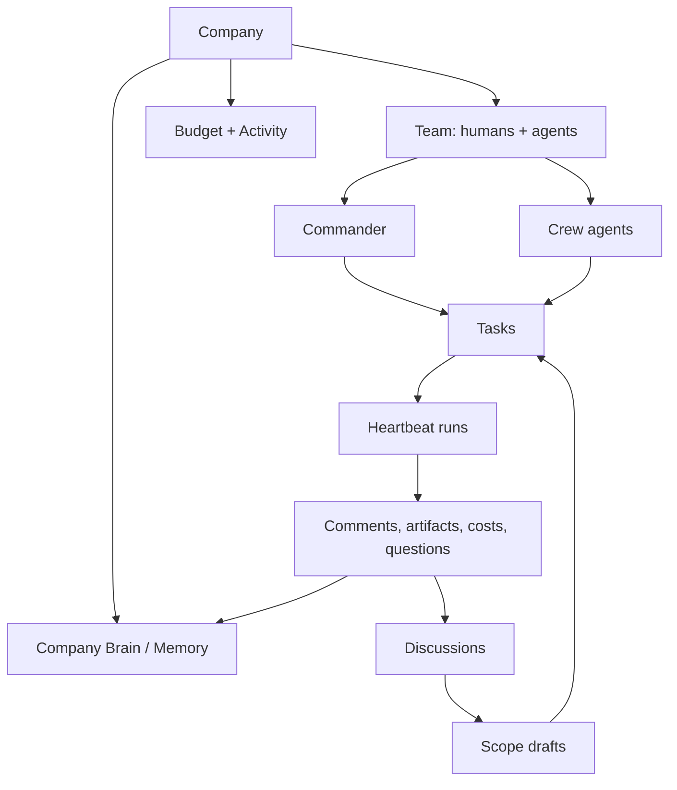
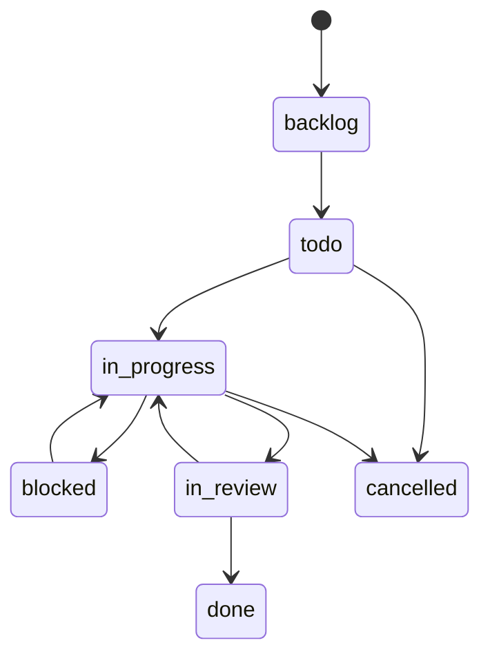

Army of Agents uses company language because it is designed to run work, not just chat. This page defines the main concepts you will see across the product.

## Concept map

## Company

A company is the top-level workspace and governance boundary. It owns the mission, settings, humans, agents, departments, tasks, discussions, memory, budgets, secrets, and activity log.

One Army of Agents instance can run more than one company, but product behavior should always stay company-scoped.

## Team

Team contains humans and agents.

Human roles include founders, team leads, and team members. Agent roles are configured with a name, title, adapter, department, manager, capabilities, budget, and status.

Team structure matters because it affects visibility, escalation, review responsibility, and who can approve certain kinds of work.

## Commander

Commander is the built-in company assistant. Use Commander to ask questions about company context, organize work, use skills, inspect tasks, and trigger governed actions.

Commander runs with the current operator's company context. It does not bypass role checks, approval gates, or tool trust rules.

## Crew

Crew is the AoA-managed agent layer that helps turn discussions into executable work. Crew can scope discussion threads, create tasks according to autonomy settings, dispatch work, and report results back to the source thread.

Crew behavior is governed by autonomy settings:

| Mode | Behavior |
| --- | --- |
| Manual | Proposes work for a human to accept |
| Assist | Creates planning tasks, then asks for dispatch approval |
| Drive | Creates standard tasks and dispatches when preflight checks pass |

## Tasks

Tasks are the unit of accountable work. Each task has a title, description, status, priority, assignee, responsible human, optional reviewer, scope, comments, and history.

The public UI says **Task**. The API and database still use `issues` for compatibility, so API docs refer to `/api/companies/{companyId}/issues` where needed.

### Task lifecycle

Agent execution uses atomic checkout semantics so one assigned agent owns the active work attempt at a time.

## Discussions

Discussions are the intake and planning workspace for ideas, transcripts, documents, decisions, and agent output. A discussion thread can be scoped into structured tasks and memory candidates.

Discussions are also where Crew loopback appears. When Crew work originates from a discussion, successful and failed runs can post back into that source thread so the planning context stays connected to execution.

## Company Brain and Memory

Company Brain is the product idea; Memory is the underlying feature area. It stores durable context for Commander and agents.

Memory has layers:

| Layer | Typical scope | Approval model |
| --- | --- | --- |
| Identity | Company-wide mission, values, durable facts | Founder approval |
| Domain | Department operating knowledge | Founder approval |
| Active Context | Project or goal context | Founder or eligible team lead approval |
| Working | Task-chain context | Created and aged out by runtime behavior |

Agents can suggest durable memory, but they do not directly approve high-trust memory layers.

## Heartbeats

Agents do not need to run forever. Army of Agents wakes them through heartbeat runs. A heartbeat gives the adapter a bounded execution window, injects task and company context, lets the agent call the API, and records output, cost, files, and state.

Heartbeats can be triggered by assignment, manual invocation, mention, schedule, or approval resolution.

## Approvals, budgets, and auditability

Army of Agents is built around governance:

- governed actions can require approval
- new agent hiring can require board approval depending on deployment mode and company settings
- budgets can auto-pause agents at hard stops
- mutating actions are logged in the activity trail
- memory visibility is scoped by actor and context

## Learn by doing

<CardGroup cols={2}>
  <Card title="Quickstart" href="/start/quickstart">
    Run the product locally and complete setup.
  </Card>
  <Card title="First agent run" href="/start/first-agent-run">
    Watch the task and heartbeat loop end to end.
  </Card>
</CardGroup>
