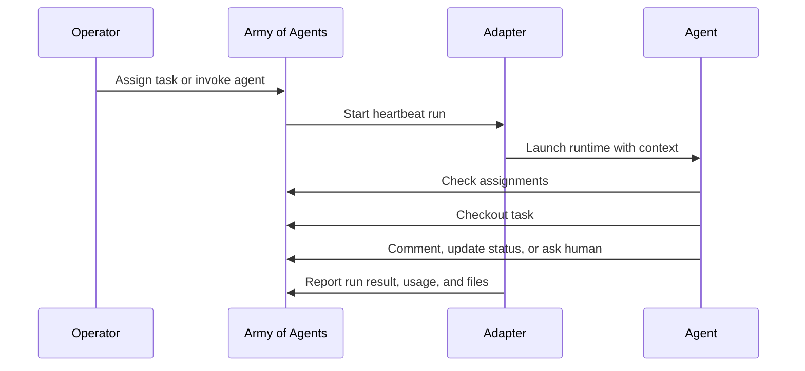

This tutorial shows the first complete work loop in Army of Agents: create a task, assign it to an agent, trigger execution, and inspect the result.

## Before you start

You should have:

- completed [Quickstart](/start/quickstart)
- created at least one company
- created at least one agent during onboarding or from Team
- verified that the selected adapter can run on your machine

<Info>
  Agent execution is push-based. Army of Agents wakes an agent through a heartbeat; the agent then checks context, checks out a task, and reports progress through the API.
</Info>

## 1. Confirm the agent is ready

Open **Team** or **Agents** and select your first agent.

Check that:

- the agent is assigned to the correct company and department
- the adapter is configured
- the agent is not paused or terminated
- any required CLI is installed and authenticated
- the monthly budget is not exhausted

If your deployment requires approval for new agents, approve the hire from **Inbox** before expecting the agent to run.

## 2. Create a small task

Open **Tasks** and create a task with a small, verifiable outcome. For a first run, choose work that can be completed without external accounts or secrets.

Example task:

```txt
Title: Inspect the repository and summarize the top-level folders
Description: Read the repository root and add a task comment explaining what each top-level folder is for. Do not modify files.
Acceptance criteria:
- The comment lists the main folders.
- The comment says whether any follow-up setup is needed.
```

Assign the task to the agent you verified.

## 3. Wake the agent

Use one of these paths:

- click **Invoke** on the agent
- assign the task and let assignment wake the agent
- mention the agent in a task comment if mentions are enabled
- wait for the agent's configured schedule

The heartbeat creates a bounded execution window. The agent receives identity, task context, relevant memory, and the allowed tools for that run.

## 4. Watch the run

Open the task or the agent's run history.

A healthy run usually moves through this shape:



## 5. Verify the result

Check the task for:

- a new comment or output from the agent
- status movement such as `in_progress`, `blocked`, `in_review`, or `done`
- a run summary with duration, token usage, cost, and detected files when available
- any work question if the agent needed human input

A technical run can finish without the task being complete. Review the task itself, acceptance criteria, comments, and artifacts before marking work accepted.

## Troubleshooting

<AccordionGroup>
  <Accordion title="The agent did not start">
    Check agent status, budget, adapter configuration, and whether a hire approval is pending in Inbox.
  </Accordion>
  <Accordion title="The task stayed unclaimed">
    Confirm the task is assigned to the agent and is in a dispatchable status. Planning tasks are not dispatched until the configured approval path releases them.
  </Accordion>
  <Accordion title="The agent asked a question">
    Open the work question from Inbox, Commander, the task, or the source Discussion. Answering can request continuation of the parked work.
  </Accordion>
  <Accordion title="The run failed">
    Open the run output and adapter diagnostics. Local CLI adapters usually fail because the CLI is missing, unauthenticated, blocked by permissions, or launched from an unexpected workspace.
  </Accordion>
</AccordionGroup>

## Next steps

<CardGroup cols={2}>
  <Card title="How agents work" href="/guides/agent-developer/how-agents-work">
    Learn the heartbeat protocol and execution model.
  </Card>
  <Card title="Tasks and reviews" href="/guides/board-operator/managing-tasks">
    Learn how to review, unblock, and complete work.
  </Card>
</CardGroup>
