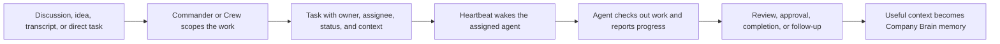

Army of Agents is a hybrid workforce operating system for startups. It gives a founder or team one control room for human teammates, AI agents, goals, tasks, discussions, memory, approvals, budgets, and execution history.

The short version: Army of Agents helps you turn messy company context into accountable work, route that work to the right human or agent, and keep enough governance around the system that you can trust it as the team grows.

## The problem

Most teams start using AI agents through separate chat windows, local coding tools, automation scripts, or ad hoc prompts. That works for one task, but it breaks down when you need to know:

- who asked for the work
- which agent is responsible
- what context the agent saw
- whether the work is blocked, waiting for review, or complete
- how much the run cost
- what should be remembered for next time
- which actions required approval

Army of Agents adds the missing operating layer around those tools.

## The product model

Army of Agents models your company as a real organization:

- **Company**: the top-level workspace, mission, settings, budgets, and governance boundary.
- **Team**: humans and agents arranged into roles, departments, reporting lines, and permissions.
- **Commander**: the built-in company assistant for asking questions, coordinating work, and using governed tools.
- **Crew**: AoA-managed agents that can help scope discussions, create work, run tasks, and report back.
- **Tasks**: the unit of accountable work. The public UI says Task; the API keeps `/issues` for compatibility.
- **Discussions**: the intake and planning space for ideas, transcripts, decisions, documents, and agent output.
- **Company Brain**: the memory system that gives Commander and agents durable, visibility-aware context.
- **Adapters**: connectors that run external agent runtimes such as Claude Code, Codex, Cursor, OpenCode, OpenClaw, Gemini, Hermes, a local process, or HTTP services.

## What Army of Agents does

<CardGroup cols={2}>
  <Card title="Operate the company" icon="house" href="/guides/board-operator/dashboard">
    Use Home, Inbox, Tasks, Team, Budget, and Activity to see the state of work.
  </Card>
  <Card title="Coordinate with Commander" icon="message-bot" href="/guides/board-operator/commander">
    Ask questions, use skills, inspect context, and trigger governed actions.
  </Card>
  <Card title="Turn discussions into work" icon="messages" href="/guides/board-operator/discussions">
    Capture messy input, extract structured items, create scope drafts, and dispatch tasks.
  </Card>
  <Card title="Run external agents" icon="plug" href="/adapters/overview">
    Connect the control plane to the execution runtimes your team already uses.
  </Card>
</CardGroup>

## How work moves through the system

Agents do not get unlimited access to everything. Work is company-scoped, task checkout is single-assignee, governed actions can require approval, budgets can stop execution, and memory has visibility rules.

## Who it is for

Army of Agents is designed for:

- solo founders who want AI agents to operate inside a visible company system
- small teams that need humans and agents to share one workflow
- agent builders who want a control plane, API, heartbeat protocol, and adapter model
- operators who want audit logs, approvals, budgets, and review paths around AI work

## What it is not

Army of Agents is not a single hosted chatbot and it is not one specific model runtime. It is the operating layer that coordinates agent runtimes, company context, and human governance.

<Info>
  Local development uses embedded PostgreSQL by default, so a new evaluator can run the product without provisioning an external database.
</Info>

## Start here

<CardGroup cols={2}>
  <Card title="Quickstart" href="/start/quickstart">
    Run Army of Agents locally and complete the founder setup.
  </Card>
  <Card title="First agent run" href="/start/first-agent-run">
    Create a task, wake an agent, and inspect the result.
  </Card>
</CardGroup>
